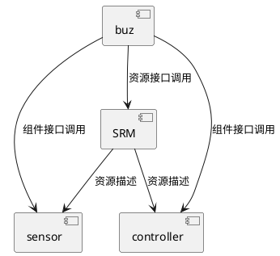

# SRM Usage

## 1. 快速开始

## 1.1. 推荐的项目结构

下面是一个项目结构示范。
```
my_project/
├── build/
│   └── deps/             // 通过CMake-FetchContent引用的SRM，会被下载到生成路径下，无需手动管理
├── CMakeLists.txt
├── main.c
├── sensor/
│   ├── srm_module.json   // 每个需要资源管理的组件，提供一份srm_module.json，来描述自己的资源视图
│   ├── imu.c
│   └── CMakeLists.txt
├── log/
│   ├── srm_module.json   // log模块定义log_string类型
│   ├── log.c
│   └── CMakeLists.txt
└── controller/
    ├── pid.c
    ├── mpc.cpp
    ├── srm_module.json
    └── CMakeLists.txt
```

示范项目依赖关系如下所示。


### 1.1. 引入SRM

**方式一：FetchContent（推荐，这样可以让组件支持独立编译）**

在任意需要使用SRM的组件/项目CMakeLists.txt中写入如下内容
```cmake
include(FetchContent)
FetchContent_Declare(srm
    GIT_REPOSITORY https://github.com/CYK-dot/srm.git
)
FetchContent_MakeAvailable(srm)
include(srm)
```

**方式二：Git Submodule（适用于小型项目）**

在项目中找一个地方引用SRM
```bash
git submodule add https://github.com/CYK-dot/srm.git /path/to/srm
```

然后在项目的根CMakeLists.txt中这样写
```cmake
list(APPEND CMAKE_MODULE_PATH "${CMAKE_SOURCE_DIR}/path/to/srm")
include(srm)
```

### 1.2. 创建SRM库（项目级）

```cmake
# 必须在 add_subdirectory 之前调用
target_add_srm_library(PROJ_ROOT_DIR ${CMAKE_SOURCE_DIR})
```

### 1.3. 链接SRM（组件级）

可执行文件或组件库均可链接。
```cmake
add_executable(my_app main.c)
target_link_srm_library(my_app)

add_library(sensor STATIC imu.c)
target_link_srm_library(sensor)
```


## 场景一：只读字符串（日志系统）

### 定义模块

```json
{
  "module": {
    "name": "log"
  },
  "local_storages": [
    {
      "name": "log_strings",
      "readonly": true
    }
  ],
  "local_types": [
    {
      "name": "log_string",
      "readonly": true
    }
  ],
  "items": [
    {
      "name": "log_err_init",
      "storages": ["log_strings"],
      "data_type": "log_string",
      "string_value": "ERR: init failed",
      "comments": ["Initialization error"]
    },
    {
      "name": "log_info_tick",
      "storages": ["log_strings"],
      "data_type": "log_string",
      "string_value": "INFO: tick:%lu",
      "comments": ["Tick count info"]
    }
  ]
}
```

### 使用生成的代码

```c
#include "srm.h"
#include "srm_layout.h"

const uint8_t *err_msg = srm_get_readonly_item(
    SRM_STORAGE_LOG_STRINGS_ID,
    SRM_ITEM_LOG_ERR_INIT_ID
);

const uint8_t *tick_msg = srm_get_readonly_item(
    SRM_STORAGE_LOG_STRINGS_ID,
    SRM_ITEM_LOG_INFO_TICK_ID
);
```

## 场景二：计数器池（共享资源）

### 定义模块

```json
{
  "module": {
    "name": "adapt"
  },
  "local_storages": [
    {
      "name": "counter_pool",
      "size": 12
    }
  ],
  "local_types": [
    {
      "name": "counter",
      "length": 4,
      "alignment": 4
    }
  ],
  "items": [
    {
      "name": "timer_tick_cnt",
      "storages": ["counter_pool"],
      "data_type": "counter"
    },
    {
      "name": "evt_post_cnt",
      "storages": ["counter_pool"],
      "data_type": "counter"
    }
  ]
}
```

### 使用生成的代码

```c
#include "srm.h"
#include "srm_layout.h"
#include <string.h>

/* 分配存储区 */
static uint8_t counter_buf[SRM_STORAGE_COUNTER_POOL_SIZE];

/* 写入计数器 */
void increment_tick(void) {
    uint32_t cnt;
    uint16_t offset = srm_get_offset(
        SRM_STORAGE_COUNTER_POOL_ID,
        SRM_ITEM_TIMER_TICK_CNT_ID
    );
    memcpy(&cnt, counter_buf + offset, sizeof(cnt));
    cnt++;
    memcpy(counter_buf + offset, &cnt, sizeof(cnt));
}
```

## 场景三：文件值（版本信息）

### 定义模块

```json
{
  "module": {
    "name": "adapt"
  },
  "local_storages": [
    {
      "name": "version_info",
      "readonly": true
    }
  ],
  "extern_types": [
    {
      "name": "log_string",
      "source_module": "log"
    }
  ],
  "items": [
    {
      "name": "version_string",
      "storages": ["version_info"],
      "data_type": "log_string",
      "file_value": "version.txt",
      "comments": ["Project version string"]
    }
  ]
}
```

### version.txt

```
v1.0.0 build:20260620
```

### 使用生成的代码

```c
#include "srm.h"
#include "srm_layout.h"

const uint8_t *version = srm_get_readonly_item(
    SRM_STORAGE_VERSION_INFO_ID,
    SRM_ITEM_VERSION_STRING_ID
);
```

## 场景四：禁用存储区（编译时裁剪）

### 定义模块

```json
{
  "module": {
    "name": "log"
  },
  "local_storages": [
    {
      "name": "log_debug",
      "readonly": true,
      "disabled": true
    }
  ],
  "local_types": [
    {
      "name": "log_string",
      "readonly": true
    }
  ],
  "items": [
    {
      "name": "log_debug_evt",
      "storages": ["log_debug"],
      "data_type": "log_string",
      "string_value": "DBG: evt:%u"
    }
  ]
}
```

### 效果

- `g_srm_log_debug_value[]` 不会生成
- `SRM_ITEM_LOG_DEBUG_EVT_ID` 不会定义
- 引用这些标识符的代码编译时报错

## API 参考

### 运行时查询

| 函数 | 参数 | 返回值 | 说明 |
|------|------|--------|------|
| `srm_get_offset` | storage_id, item_id | uint16_t | 数据项在存储区中的偏移 |
| `srm_get_storage_size` | storage_id | uint16_t | 存储区大小（字节） |
| `srm_get_item_size` | item_id | uint16_t | 数据项大小（字节） |
| `srm_get_readonly_item` | storage_id, item_id | const uint8_t* | 只读数据项指针 |
| `srm_get_readonly_storage` | storage_id | const uint8_t* | 只读存储区指针 |

### CMake 接口

| 函数 | 层级 | 参数 | 说明 |
|------|------|------|------|
| `target_add_srm_library` | 项目级 | PROJ_ROOT_DIR, [OUTPUT_DIR] | 创建 SRM 静态库（必须在 add_subdirectory 之前） |
| `target_link_srm_library` | 组件级 | target | 链接 SRM 库（提供头文件路径） |

## CMake 参数

### target_add_srm_library

| 参数 | 必填 | 默认值 | 说明 |
|------|------|--------|------|
| PROJ_ROOT_DIR | 是 | - | 项目根目录（包含模块子目录） |
| OUTPUT_DIR | 否 | `${CMAKE_BINARY_DIR}/srm_generated` | 生成文件输出目录 |

### target_link_srm_library

| 参数 | 必填 | 说明 |
|------|------|------|
| target | 是 | 要链接 SRM 的目标名称 |

## JSON 字段参考

### local_storages

| 字段 | 类型 | 必填 | 说明 |
|------|------|------|------|
| name | string | 是 | 存储区名称（全局唯一） |
| readonly | boolean | 否 | 是否只读（默认 false） |
| disabled | boolean | 否 | 是否禁用（仅 readonly 支持） |
| size | integer | 条件 | 存储区大小（readonly 时可省略） |
| comments | array | 否 | Doxygen 注释 |

### local_types

| 字段 | 类型 | 必填 | 说明 |
|------|------|------|------|
| name | string | 是 | 类型名称（全局唯一） |
| length | integer | 条件 | 读写类型必须指定；字节长度（正整数） |
| alignment | integer | 否 | 对齐方式（默认 1，必须是 2 的幂） |
| readonly | boolean | 否 | 是否只读（默认 false） |
| comments | array | 否 | Doxygen 注释 |

### extern_types

| 字段 | 类型 | 必填 | 说明 |
|------|------|------|------|
| name | string | 是 | 类型名称（必须存在于 source_module 的 local_types 中） |
| source_module | string | 是 | 源模块名称（必须是已定义的模块） |
| comments | array | 否 | Doxygen 注释 |

### items

| 字段 | 类型 | 必填 | 说明 |
|------|------|------|------|
| name | string | 是 | 数据项名称（全局唯一） |
| storages | array | 是 | 存储区名称列表 |
| data_type | string | 是 | 数据类型（必须在 local_types 或 extern_types 中定义） |
| string_value | string | 条件 | 只读字符串值 |
| file_value | string | 条件 | 只读文件路径（相对 srm_module.json） |
| comments | array | 否 | Doxygen 注释 |
